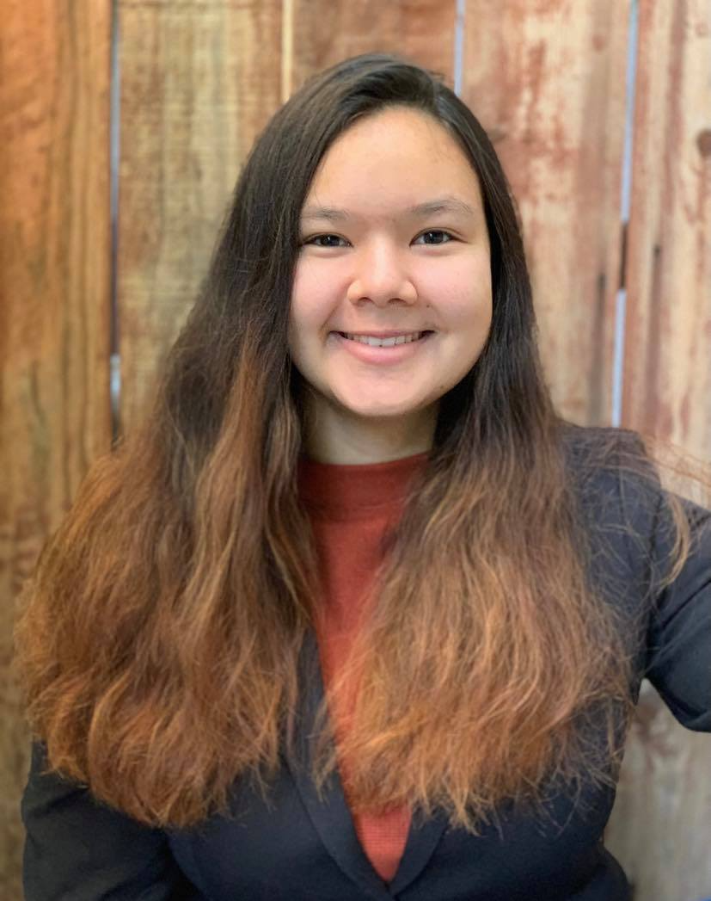

  
# Katherine Baker's User Page  
Hello, my name is ***Katherine Baker*** and I am a *second-year computer science* student at *UCSD*. I ultimately hope to go to law school to pursure a career as a *patent attorney*.  

My senior quote in high school was by Potter Stewart:  

> Censorship reflects a society's lack of confidence in itself.

Additionally, I started learning computer science in high school with AP Computer Science learning:  

```
System.out.println("Hello World");
```

This is a link to [Google](https://www.google.com/) where you can find most information.  

This is a section link to my COGS 18 Final Project [readme](https://github.com/klbaker/battleship#battleship)  

For information about my favorite programming language check the [README] (README.md)  

I am in the following organizations  
- Club Gymnastics
- Phi Sigma Rho
- Kappa Alpha Pi

In order of learning them I know the following languages:  
1. Java
2. Python
3. C++
4. C

On my path to finishing this lab I have the following steps:
- [x] Start the lab
- [ ] Finish the lab
